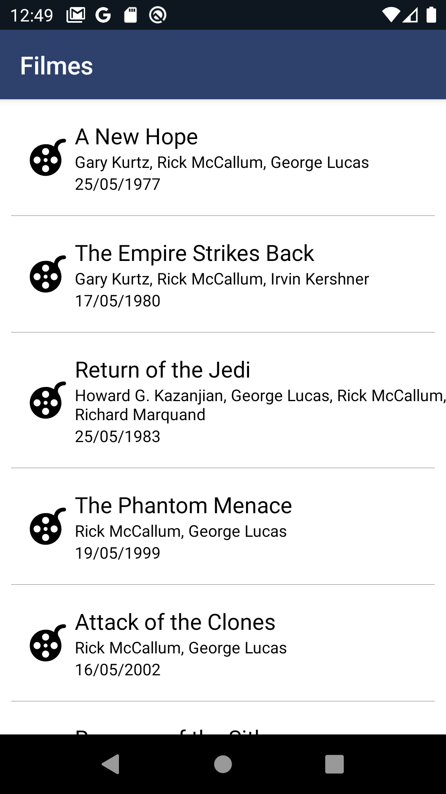
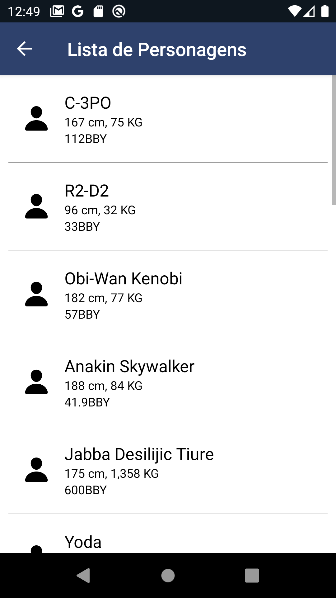
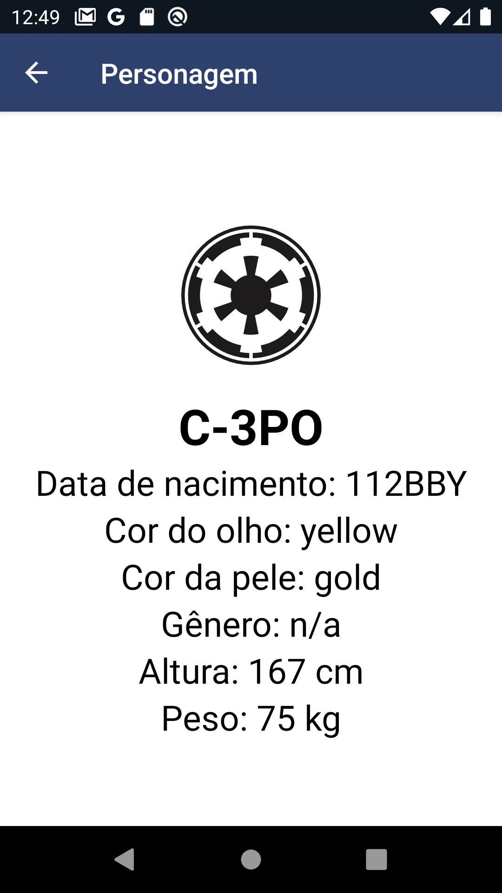

# Test Livelo - Dados do Star Wars

## Introdução

> Projeto criado para o teste para vaga na Livelo, utilizando a api https://swapi.dev/api para pegar dados sobre Filmes e Personagens do Star Wars, utilizei o React native para a construção do app e redux para persistencia de dados com o redux-persist para manter dados offline e animção com react-native-animatable

## Instalação

> Para fazer a intalação utilize o `npm install ` ou `yarn install`
> e para rodar no android `npm run android ` e ios `npm run ios`

versões utilizadas

npm: 7.5.4
node: 15.8.0

